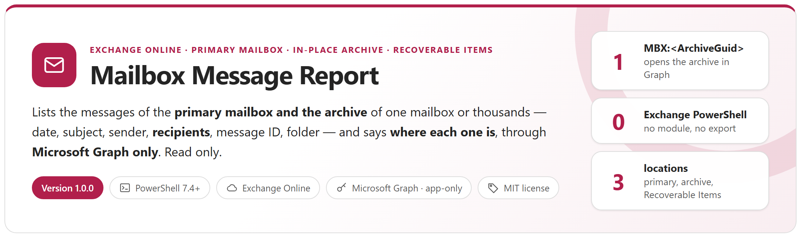
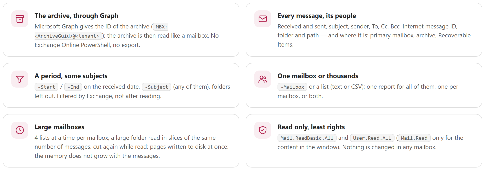
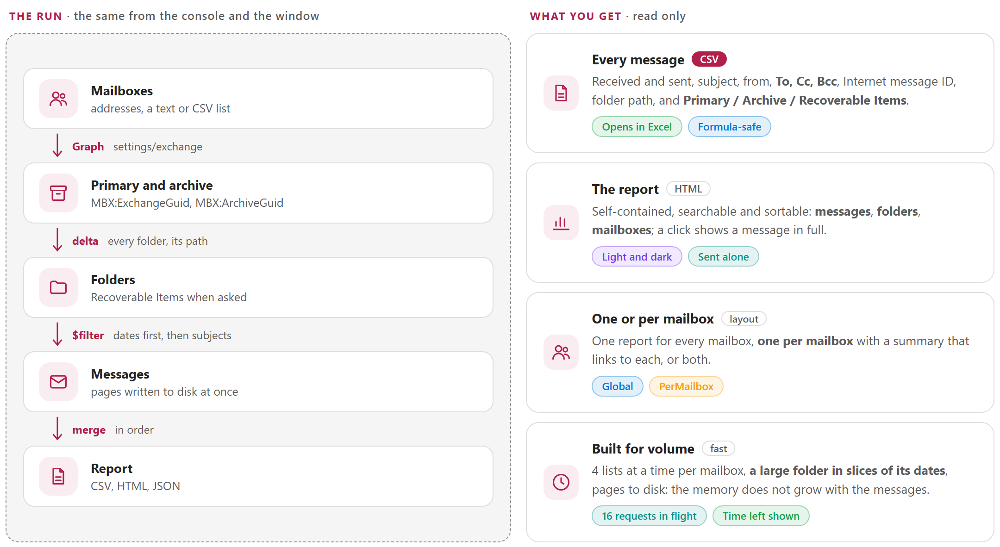
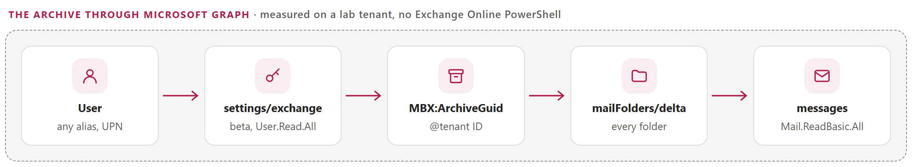
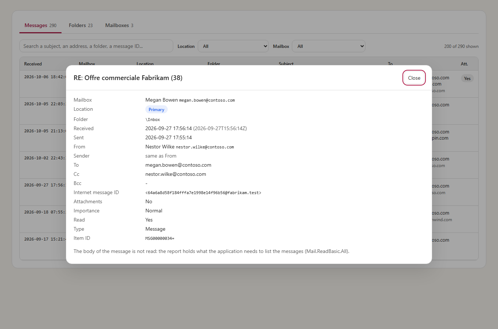
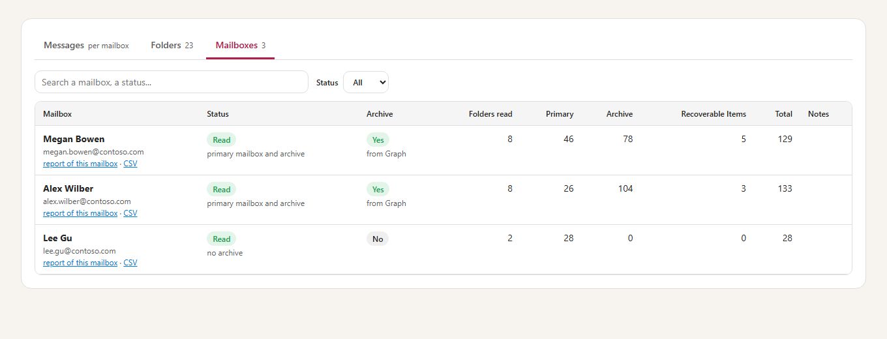
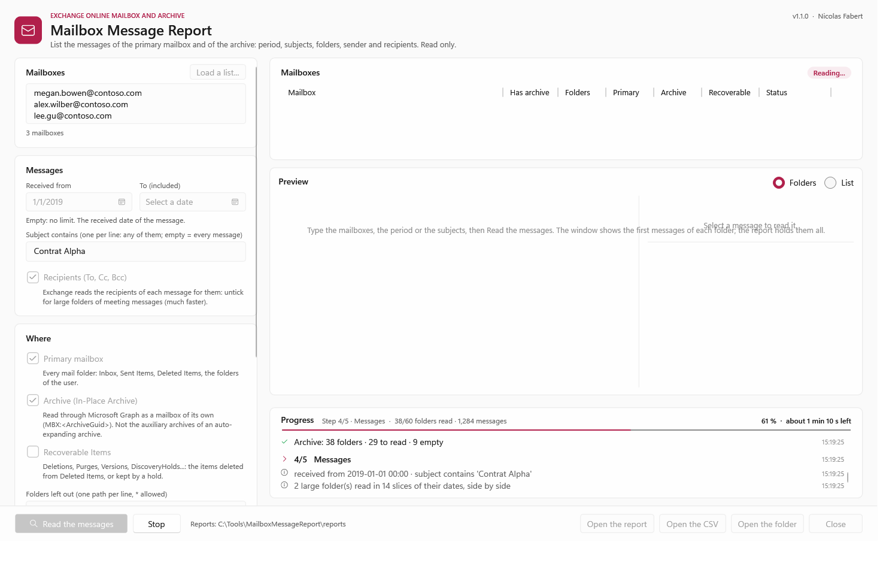

<p align="center">
  <picture>
    <source media="(prefers-color-scheme: dark)" srcset="docs/images/readme-banner-dark.png">
    
  </picture>
</p>

<p align="center">
  <a href="#how-it-works"><b>How it works</b></a> &nbsp;&middot;&nbsp;
  <a href="#the-archive-through-microsoft-graph"><b>The archive</b></a> &nbsp;&middot;&nbsp;
  <a href="#reports"><b>Reports</b></a> &nbsp;&middot;&nbsp;
  <a href="#quick-start"><b>Quick start</b></a> &nbsp;&middot;&nbsp;
  <a href="docs/MailboxMessageReport-UserGuide.md"><b>User guide</b></a> &nbsp;&middot;&nbsp;
  <a href="docs/MailboxMessageReport-Guide.md"><b>Developer guide</b></a>
</p>

> [!IMPORTANT]
> Files downloaded from the Internet may be blocked by Windows and fail to run. Before using this project, unblock every file in the downloaded folder:
>
> ```powershell
> Get-ChildItem "C:\Chemin\Du\Dossier" -Recurse -File -Force | Unblock-File
> ```
>
> Replace the example path with the folder where you downloaded or extracted this project.

## Why

*Which messages are in this archive? Did these people receive this contract, and where is it now — in the mailbox, in the archive, or deleted?* eDiscovery answers with an export, `Get-MailboxFolderStatistics` with counts, Outlook one mailbox at a time. None of them gives a plain list of the messages — date, subject, sender, recipients, folder — of the primary mailbox **and** of the archive, for many mailboxes at once.

The mail API of Microsoft Graph is documented for the primary mailbox only. But the In-Place Archive is a mailbox of its own for Exchange Online: Graph gives its ID (`MBX:<ArchiveGuid>@<tenant ID>`) and opens it with the same API. This tool builds on that — measured on a lab tenant — to list every message of the primary mailbox, the archive and Recoverable Items, with **Microsoft Graph only**: no Exchange Online PowerShell, no export. **It only reads.**

<picture>
  <source media="(prefers-color-scheme: dark)" srcset="docs/images/readme-principles-dark.png">
  
</picture>

## How it works

<picture>
  <source media="(prefers-color-scheme: dark)" srcset="docs/images/readme-how-it-works-dark.png">
  
</picture>

- **The primary mailbox and the archive**: every mail folder of both, with its path (`\Inbox\Projects\Alpha`); **Recoverable Items** with `-IncludeRecoverableItems` (*Deletions*, *Purges*, *Versions*, *DiscoveryHolds*...). Each message says where it is: *Primary* or *Archive*, and *Recoverable Items* or not.
- **What is read**: received and sent date and time, subject, sender, **To, Cc, Bcc**, Internet message ID, folder and path, attachments, importance, type. The reports never hold the body or the attachments.
- **Filtered by Exchange**: the period (`-Start`, `-End`, received date) and the subjects (`-Subject`, any of them) are a `$filter` of Graph, written the way Exchange accepts it (the date first, then `contains()`). Folders can be left out (`-ExcludeFolder '\Junk Email'`).
- **One mailbox or thousands**: `-Mailbox` or a list (text or CSV); one report for all of them, **one per mailbox** (with a summary that links to each), or both.
- **Large mailboxes**: 16 requests in flight, 4 at a time per mailbox (a primary mailbox and its archive are two mailboxes); a folder of more than 5,000 items is read in **slices of its dates**, side by side; each page is written to disk at once — the memory does not grow with the messages. The console and the window give the time left.
- **The window, like Outlook**: the search typed in the window, then the folders of each mailbox and of its archive in a tree, the first 10 messages of each folder, and a **reading pane** with the recipients, the dates, the folder and the content of the message selected (read on demand, with `Mail.Read`, logged).
- **Application permissions of Microsoft Graph** and a certificate: `Mail.ReadBasic.All` and `User.Read.All` (`Mail.Read` only for the content in the reading pane); no user account, no module.

## The archive through Microsoft Graph

<picture>
  <source media="(prefers-color-scheme: dark)" srcset="docs/images/readme-archive-dark.png">
  
</picture>

```http
GET /beta/users/megan.bowen@contoso.com/settings/exchange
    -> "inPlaceArchiveMailboxId": "MBX:3f8b52d6-...@0b6c7d1e-..."     (= ArchiveGuid of Get-EXOMailbox)
GET /v1.0/users/MBX:3f8b52d6-...@0b6c7d1e-.../mailFolders/delta
GET /v1.0/users/MBX:3f8b52d6-...@0b6c7d1e-.../mailFolders/{id}/messages?$filter=receivedDateTime ge ... and contains(subject,'...')
```

- **No Exchange Online PowerShell**: `settings/exchange` gives the archive ID with `User.Read.All`. Without it, a CSV list can give the `ArchiveGuid` of each mailbox (`Get-EXOMailbox -Properties ArchiveGuid | Export-Csv`).
- **`Mail.ReadBasic.All` is enough** — measured with temporary applications: the folders and every column of the report, in the archive and in Recoverable Items too.
- **Not the auxiliary archives** of an auto-expanding archive: a folder whose content moved there is reported *Failed*, the others are read. `settings/exchange` is a beta endpoint of Graph.

Every measurement is in the [developer guide, chapter 3 and appendix C](docs/MailboxMessageReport-Guide.md#3-the-archive-through-microsoft-graph).

## Reports

<table>
  <tr>
    <td width="50%" valign="top"><a href="docs/images/report-overview.png"></a><br><sub><b>HTML report</b> &middot; messages per location, every message searchable and sortable, the folders and the mailboxes</sub></td>
    <td width="50%" valign="top"><a href="docs/images/gui-search-light.png"></a><br><sub><b>Window</b> &middot; the search on the left; the folders of the mailboxes and of their archive like Outlook, the first messages of each folder and a reading pane</sub></td>
  </tr>
  <tr>
    <td width="50%" valign="top"><a href="docs/images/report-message.png"></a><br><sub><b>A message</b> &middot; every column: dates, sender, recipients, Internet message ID, folder, location</sub></td>
    <td width="50%" valign="top"><a href="docs/images/report-mailboxes.png"></a><br><sub><b>One report per mailbox</b> &middot; the summary links to the report and the CSV file of each mailbox</sub></td>
  </tr>
</table>

<details>
<summary><b>A run in progress</b> &middot; the step, the part done and the time left; the window keeps answering</summary>
<br>
<a href="docs/images/gui-progress-light.png"></a>
</details>

<details>
<summary><b>The preview as a list</b> &middot; every message of the preview, sortable</summary>
<br>
<a href="docs/images/gui-list-light.png"></a>
</details>

Each run writes `MailboxMessageReport-Messages.csv` (every message), `-Mailboxes.csv`, `-Folders.csv`, `-Summary.json` and a self-contained HTML report (the first 20,000 messages), in a folder of its own; with `-Layout PerMailbox` or `Both`, the CSV and HTML report of each mailbox in `Mailboxes\`.

## Requirements

| Item | Requirement |
|---|---|
| Exchange | **Exchange Online**: the primary mailbox, its In-Place Archive (not the auxiliary archives) and Recoverable Items |
| PowerShell | 7.4 or later — a portable zip is enough; 7.5 or later for the Windows 11 look of the window |
| Windows | Windows 10 / 11 or Windows Server 2016 to 2025; the window needs a desktop session, the command line runs anywhere (scheduled task) |
| Application | An application registered in Microsoft Entra with the **application** permissions `Mail.ReadBasic.All` and `User.Read.All` (admin consent), and a **certificate** whose private key is in the Windows store of the account that runs the tool ([developer guide, chapter 5](docs/MailboxMessageReport-Guide.md#5-application)) |
| Account | No Exchange or Entra role to run it: the application signs in. No module. |
| Network | HTTPS to `login.microsoftonline.com` and `graph.microsoft.com` |

## Quick start

Download `MailboxMessageReport-<version>.zip` from the [latest release](https://github.com/Nico77600/MailboxMessageReport/releases/latest), extract it (for example in `C:\Tools`) and unblock the files (command at the top of this page).

```powershell
cd C:\Tools\MailboxMessageReport-1.1.0
notepad .\config\MailboxMessageReport.config.psd1          # tenant, application, certificate thumbprint

.\Invoke-MailboxMessageReport.ps1 -Gui                     # the window

# Or the command line: nothing is ever changed in a mailbox
.\Invoke-MailboxMessageReport.ps1 -Mailbox megan.bowen@contoso.com                                   # primary mailbox and archive
.\Invoke-MailboxMessageReport.ps1 -Mailbox megan.bowen@contoso.com -Location Archive -Start 2019-01-01 -End 2019-12-31
.\Invoke-MailboxMessageReport.ps1 -MailboxFile .\team.csv -Subject 'Contrat Alpha' -IncludeRecoverableItems -Layout Both
.\Invoke-MailboxMessageReport.ps1 -Mailbox room-paris-01@contoso.com -SkipRecipients                # very large folders, fast
```

One command per everyday question — what is in this archive, who received this message and where it is now, what arrived in a period, a report for every mailbox of a team: see the [user guide](docs/MailboxMessageReport-UserGuide.md).

The zip of each [release](https://github.com/Nico77600/MailboxMessageReport/releases) contains only the files needed to run, with both guides in HTML; `.\tools\New-MailboxMessageReportPackage.ps1` builds the same package from the repository.

## Documentation

| Guide | Content |
|---|---|
| **[User guide](docs/MailboxMessageReport-UserGuide.md)** | For the people who run the tool: **prerequisites**, the one-time setup and **everyday commands only** — the messages of an archive, where a message is, a period, a team, the archive without `User.Read.All`, a very large mailbox, the window, the results. |
| **[Developer guide](docs/MailboxMessageReport-Guide.md)** | Everything else: how it works, **how the archive is read through Microsoft Graph** (measured), what is read and how it is filtered, the application and the least permissions, every setting and parameter, the window, the report, the files produced, the architecture, performance and limits, tests, troubleshooting, security. |

Both guides also exist as a single HTML file with a light and a dark theme (`docs/MailboxMessageReport-UserGuide.html`, `docs/MailboxMessageReport-Guide.html`): download them and open them locally, or use the copies in the release zip.

## Tests

```powershell
.\Run-Tests.ps1                                             # Pester 6.1+, a simulated Exchange Online tenant, no network
pwsh -File .\tools\Measure-MailboxMessageReport.ps1 -Messages 500000 -Simulated   # time of each step, synthetic data
```

The tool was also validated on a lab tenant: primary mailboxes and archives read through their `MBX:` IDs, Recoverable Items, mailboxes without archive, on-premises and not found, a list with `ArchiveGuid` and the permissions measured with temporary applications, periods and subjects, a folder of 39,419 messages read in 8 slices — every message once ([developer guide, appendix C](docs/MailboxMessageReport-Guide.md#appendix-c---lab-measurements)).

## License

[MIT](LICENSE).

## Disclaimer

Personal project, provided as is. It is not an official Microsoft product and is not supported by Microsoft. The archive is read through an ID that Microsoft Graph gives (a beta endpoint) and opens, but that its documentation does not describe for the archive: test it in your environment before production use. The reports contain personal data (addresses, subjects): store and share them accordingly.
