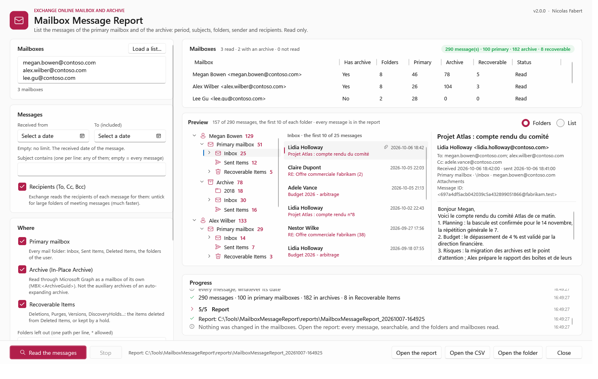
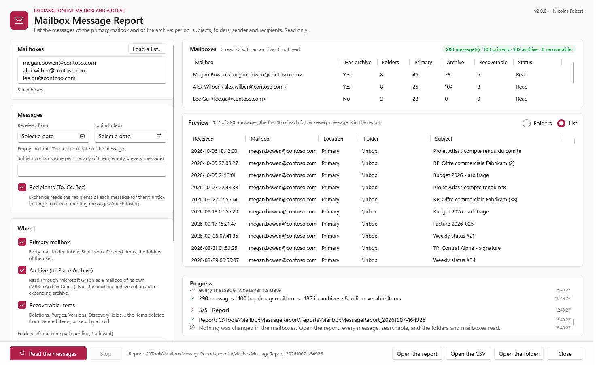
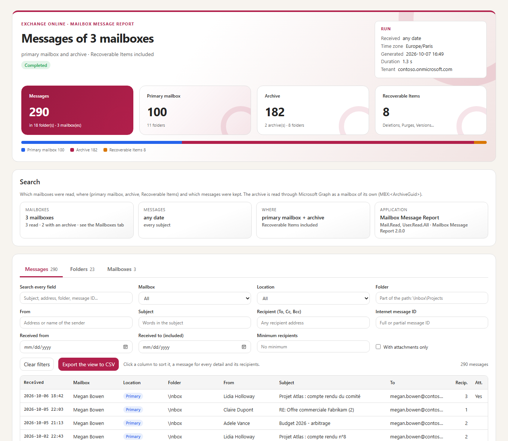

# Mailbox Message Report — Developer guide

> Lists the messages of **Exchange Online** mailboxes — the **primary mailbox** and the **In-Place Archive**, and **Recoverable Items** when asked — through **Microsoft Graph only**: no Exchange Online PowerShell, no export. For each message: the date and time received and sent, the subject, the sender, the recipients (To, Cc, Bcc), the Internet message ID, the folder and its path, and whether it is in the primary mailbox, the archive or Recoverable Items. Over a period, for some subjects, for one mailbox or a list; one report for all of them, one per mailbox, or both. Console, window, CSV, JSON and HTML reports. **Read only.**

> [!IMPORTANT]
> Files downloaded from the Internet may be blocked by Windows and fail to run. Before using this project, unblock every file in the downloaded folder:
>
> ```powershell
> Get-ChildItem "C:\Chemin\Du\Dossier" -Recurse -File -Force | Unblock-File
> ```
>
> Replace the example path with the folder where you downloaded or extracted this project.

> [!NOTE]
> This is the **developer guide**: how the tool works, how the archive is read through Microsoft Graph, the rights, every setting, the window, the report, the architecture, the measurements and how to modify and validate the tool. For the prerequisites and the everyday commands only, read the [user guide](MailboxMessageReport-UserGuide.md).

```cards
archive | The archive, through Graph | Microsoft Graph gives the ID of the archive (`MBX:<ArchiveGuid>@<tenant>`); the archive is then read like a mailbox. No Exchange Online PowerShell, no export.
mail | Every message, its people | Received and sent, subject, sender, To, Cc, Bcc, Internet message ID, folder and path — and where it is: primary mailbox, archive, Recoverable Items.
filter | A period, some subjects | `-Start` / `-End` on the received date, `-Subject` (any of them), folders left out. Filtered by Exchange, not after reading.
people | One mailbox or thousands | `-Mailbox` or a list (text or CSV); one report for all of them, one per mailbox, or both.
clock | Large mailboxes | 4 lists at a time per mailbox, a large folder read in slices of its dates; pages written to disk at once: the memory does not grow with the messages.
shield | Read only, least rights | `Mail.ReadBasic.All` (never the body) and `User.Read.All`. Nothing is changed in any mailbox.
```

## Quick start

```steps
Install | Copy the folder, unblock the files, check PowerShell 7.4 or later (chapter 6).
Application | Register an application in Microsoft Entra with `Mail.ReadBasic.All` and `User.Read.All` (application permissions, admin consent) and a certificate (chapter 5).
Configure | Tenant, application and certificate in `config\MailboxMessageReport.config.psd1` (chapter 7).
Report | `.\Invoke-MailboxMessageReport.ps1 -Mailbox john.doe@contoso.com` lists every message of his primary mailbox and of his archive.
Narrow | `-Start 2019-01-01 -End 2019-12-31`, `-Subject 'Contrat Alpha'`, `-Location Archive`, `-IncludeRecoverableItems`, `-MailboxFile .\team.csv -Layout Both`. Or `-Gui` for the window.
```

> [!TIP]
> The tool only reads. A report can be run again at any time; nothing in a mailbox changes, not even the *read* state of a message.

# Part I · Understand

<!-- icon: target -->
## 1. Purpose

*Which messages are in this archive? Did this person receive this contract, and where is it now — in the mailbox, in the archive, or deleted?* Exchange administrators answer these questions with eDiscovery, with `Get-MailboxFolderStatistics`, or by opening the mailbox. None of them gives a simple list of the messages — date, subject, sender, recipients, folder — of the primary mailbox **and** of the archive, for many mailboxes at once.

Microsoft Graph documents its mail API for the primary mailbox and the shared mailboxes, and states that the archive is not supported. In practice the archive is a mailbox of its own for Exchange Online, with its own GUID (the *ArchiveGuid*): Graph opens it from its ID, `MBX:<ArchiveGuid>@<tenant ID>`, and its folders and messages are read with the same API (chapter 3, measured in a lab tenant). Graph also gives this ID: Exchange Online PowerShell is not needed.

```cards
search | One list for every place | The primary mailbox, the archive and Recoverable Items in the same report, with a column that says where each message is.
filter | Filtered at the source | The period and the subjects are a `$filter` of Graph: Exchange returns only the messages asked for.
file | Reports made for volume | Every message in the CSV file (Excel, cells within the size of an Excel cell) and in a self-contained HTML report, compressed, with filters (1,000,000 messages: 32 MB, opens in 4 s); one report per mailbox if needed.
shield | Least rights | `Mail.ReadBasic.All` never gives the body or the attachments of a message; RBAC for Applications can limit it to some mailboxes.
```

<!-- icon: flow -->
## 2. How it works

```flow
user | Mailboxes | addresses, list
arrow | Graph | settings/exchange
archive | Archive | MBX:ArchiveGuid
arrow | delta | every folder
folder | Folders | paths
arrow | filter | dates, subjects
mail | Messages | pages to disk
arrow | merge | in order
file | Report | CSV, HTML, JSON
```

| Stage | What happens |
|---|---|
| **Mailboxes** | Each address of the request (typed, or a text or CSV file) is looked up in the directory — any SMTP alias, then the UPN — for its user ID and display name. |
| **Archive** | `GET /beta/users/{id}/settings/exchange` gives `primaryMailboxId` and, when the user has one, `inPlaceArchiveMailboxId` = `MBX:<ArchiveGuid>@<tenant ID>`. A CSV list can give the `ArchiveGuid` instead. A mailbox on-premises or inactive answers *MailboxNotEnabledForRESTAPI*: it is reported, not read. |
| **Folders** | `GET .../mailFolders/delta`: every mail folder of the primary mailbox and of the archive, flat, 200 a page, with its parent and its number of items; the path of each folder is rebuilt from its parents (`\Inbox\Projects\Alpha`). Recoverable Items: the folders under `recoverableitemsroot`. A folder without items, or left out (`-ExcludeFolder`), is not read. |
| **Messages** | Each folder, page after page: `$select` the columns of the report, `$filter` the period and the subjects, `$orderby` the received date (newest first). A folder of more than 5,000 items is cut into slices of its dates, read side by side. Each page goes to the part file of its folder at once. |
| **Report** | The part files are merged in the order of the report — mailbox, primary mailbox then archive, Recoverable Items last, folder path, newest first — into the CSV file(s), the HTML report(s) and `Summary.json`; then they are deleted. A daily log. |

At most 16 requests are in flight, and 4 at a time for one mailbox (a limit of Exchange Online); a primary mailbox and its archive are two mailboxes. A 429 or 5xx answer is retried after its *Retry-After* delay. A page that Exchange Online cuts short (a 200 whose JSON ends early) is asked again, smaller (chapter 4).

<!-- icon: archive -->
## 3. The archive through Microsoft Graph

The [Outlook mail API overview](https://learn.microsoft.com/graph/api/resources/mail-api-overview) says that Graph does not support accessing In-Place Archive mailboxes. What it does not support is the archive **as a folder of the user's mailbox**: `/users/{user}/mailFolders` lists the primary mailbox only. The archive itself is a mailbox with its own GUID, and Graph opens a mailbox from its ID:

```http
GET https://graph.microsoft.com/beta/users/megan.bowen@contoso.com/settings/exchange
  -> { "primaryMailboxId": "MBX:7c2e91a4-...@0b6c7d1e-...",
       "inPlaceArchiveMailboxId": "MBX:3f8b52d6-...@0b6c7d1e-..." }

GET https://graph.microsoft.com/v1.0/users/MBX:3f8b52d6-...@0b6c7d1e-.../mailFolders/delta
GET https://graph.microsoft.com/v1.0/users/MBX:3f8b52d6-...@0b6c7d1e-.../mailFolders/{id}/messages
```

| Measured in the lab tenant (2026-10-07) | Result |
|---|---|
| `settings/exchange` (beta), application token | 200 for every mailbox in Exchange Online: `inPlaceArchiveMailboxId` present only when the user has an archive; 404 *MailboxNotEnabledForRESTAPI* for a mailbox on-premises or inactive |
| The GUID of `inPlaceArchiveMailboxId` | **equal** to `ArchiveGuid` of `Get-EXOMailbox`; the GUID of `primaryMailboxId` equal to `ExchangeGuid` |
| `settings/exchange` with `User.ReadBasic.All` (or no user permission) | 403 *ErrorAccessDenied*: it needs `User.Read.All` |
| `/users/MBX:<ArchiveGuid>@<tenant>/mailFolders`, `/mailFolders/delta`, `/mailFolders/{id}/messages` | the folders and the messages of the archive, with `Mail.ReadBasic.All`, `Mail.Read` or `Mail.ReadWrite` |
| Recoverable Items of the primary mailbox and of the archive (`recoverableitemsroot`, `recoverableitemsdeletions`, `purges`, `versions`, `discoveryholds`) | readable with the same permissions: *Deletions*, *Purges*, *Versions*, *DiscoveryHolds*, *SubstrateHolds*, *Calendar Logging* |

**Without `User.Read.All`.** The archive ID is `MBX:<ArchiveGuid>@<tenant ID>`: give the `ArchiveGuid` of each mailbox in a CSV list, exported once by an Exchange administrator:

```powershell
Get-EXOMailbox -ResultSize Unlimited -Archive -Properties ArchiveGuid |
    Select-Object PrimarySmtpAddress, ArchiveGuid | Export-Csv .\archives.csv -NoTypeInformation
```

**Why not the mailbox import / export API.** Graph also has an [import and export API](https://learn.microsoft.com/graph/mailbox-import-export-concept-overview) that reaches the archive (and its auxiliary archives), but its items expose only their type, size and dates, and `exportItems` returns an opaque stream made to be imported again, not read. The mail API gives the subject, the sender and the recipients directly.

> [!WARNING]
> **Auto-expanding archives are out of scope.** Once an archive has grown into auxiliary archives, a folder of the main archive may keep its content in an auxiliary archive: the mail API answers an error for it (the import / export API answers a redirect). The tool reports such a folder as *Failed* with this reason and reads the others. `settings/exchange` is a **beta** endpoint of Graph: if it changed, the ArchiveGuid of a CSV list still works.

<!-- icon: mail -->
## 4. What is read

| Option | Graph | Notes |
|---|---|---|
| `-Location Primary, Archive` | the mailbox, the archive (`MBX:` ID) | Default: both (`Search.Locations`). |
| `-IncludeRecoverableItems` | the folders under `recoverableitemsroot` | Path `\Recoverable Items\Deletions`, column *RecoverableItems* = *Yes*. Items deleted from *Deleted Items*, items purged and kept by a hold or by the single item recovery. |
| `-Start` · `-End` | `receivedDateTime ge` · `lt` | In the time zone of `Report.TimeZone`; an end date without a time is included. No start and no end: every message. |
| `-Subject` | `contains(subject,'...')`, several joined by `or` | Any case, part of the subject. |
| `-ExcludeFolder` | — (the folder is not read) | Path with wildcards: `\Junk Email`, `\Inbox\Newsletters*`, `\Recoverable Items\Purges`. |
| `-SkipRecipients` | `$select` without To, Cc, Bcc | Much faster on folders of meeting messages (chapter 13). |

> [!NOTE]
> **Exchange and `contains()`.** Exchange refuses a filter on the subject before a condition on the date, and refuses `contains()` with `$orderby` alone (*InefficientFilter: The restriction or sort order is too complex for this operation*, measured). The tool always writes the date first; with subjects and no start date, the filter starts with `receivedDateTime ge 1900-01-01T00:00:00Z`.

**A large folder.** A folder of more than `Graph.SplitFolderItems` items (5,000) is read in slices of its received dates: its oldest and newest message (of the filter) are read first, one message each; the period between them is cut in equal parts, one per 5,000 items, 16 at most; the slices are read side by side, 4 at a time for one mailbox, each page after page. Every message is read once (two slices meet on the same second, `lt` / `ge`), and the report keeps the order of the folder, newest first. The newest slice has no end and the oldest no start (but those of the period asked): a message newer or older than the two read first is read as well.

**A page cut short.** Exchange Online sometimes answers a page of messages with a status 200 and a JSON that stops early (seen on a customer tenant: 410 bytes, the end of `"value":[`, on a slice of a large folder): a page that took it too long (the recipients of meeting messages are read one by one), or a message it cannot return. The run goes on (version 1.0.0 stopped with *Expected depth to be zero at the end of the JSON payload*): the page is asked again once; then with half as many messages, down to one (the next pages grow back to `Graph.PageSize`); then that one message without its sender and recipients; at last it is left out (`$skip`) and the list goes on. Each step is in the log (*Graph answered a page cut short*); a message left out or without its sender and recipients is counted in the *Folders* tab (*Detail*) and the run finishes with warnings (exit code 2). A list of folders cut short is asked again up to `Graph.MaxRetries` times.

**The columns of a message.**

| Column | Graph | Content |
|---|---|---|
| `Mailbox` · `MailboxName` | — | The primary SMTP address and the display name of the mailbox. |
| `Location` | — | `Primary` or `Archive`. |
| `RecoverableItems` | — | `Yes` for a folder of Recoverable Items. |
| `FolderPath` · `Folder` | `parentFolderId`, `displayName` | `\Inbox\Projects\Alpha` and `Alpha`. |
| `Received` · `Sent` | `receivedDateTime`, `sentDateTime` | `yyyy-MM-dd HH:mm:ss` in the time zone of the report. |
| `Subject` | `subject` | |
| `From` · `FromName` · `Sender` | `from`, `sender` | `Sender` differs from `From` for a message sent on behalf. |
| `To` · `Cc` · `Bcc` | `toRecipients`, `ccRecipients`, `bccRecipients` | Addresses separated by `; `. *Bcc* is known to the sender only: it is filled in the sent items. |
| `InternetMessageId` | `internetMessageId` | The `Message-ID` header: the same message in every mailbox, a message trace, eDiscovery. |
| `HasAttachments` · `Importance` · `IsRead` | | |
| `Type` | `@odata.type` | `Message`, `Meeting request`, `Meeting response`, `Meeting message`... |
| `ReceivedUtc` · `ItemId` | `receivedDateTime`, `id` | For scripts: the date in UTC, the Graph ID of the message. |

The body, the attachments and the headers are never read (`Mail.ReadBasic.All` does not give them). The folders listed are the mail folders of Graph: *Calendar*, *Contacts*, *Tasks* and the hidden folders (*Conversation History\Team Chat*) are not.

# Part II · Set up

<!-- icon: key -->
## 5. Application

The tool signs in as an **application** (no user), with application permissions of Microsoft Graph and admin consent:

| Permission | Why | Without it |
|---|---|---|
| `Mail.ReadBasic.All` | the folders and the messages (every column of the report) of the primary mailbox, the archive and Recoverable Items | required; `Mail.Read` or `Mail.ReadWrite` count as well. `Mail.Read` also gives the content of a message: only the reading pane of the window reads it, one message at a time (chapter 9); the reports never hold it |
| `User.Read.All` | the user of each address (any alias, the display name) and the ID of its archive (`settings/exchange`) | the address is read as typed; the archive only from the `ArchiveGuid` of a CSV list (chapter 3) |

Measured with temporary applications in the lab tenant (2026-10-07; the lab scripts are not part of the repository):

| Application permissions | User | Archive ID | Folders, messages (archive, Recoverable Items) | Body, size |
|---|---|---|---|---|
| `Mail.ReadBasic.All` | 403 | 403 | **200** (subject, from, to, cc, bcc, dates, message ID) | 403 |
| `Mail.ReadBasic.All` + `User.ReadBasic.All` | 200 | 403 | 200 | 403 |
| `Mail.Read` + `User.ReadBasic.All` | 200 | 403 | 200 | 200 |
| `Mail.Read` + `User.Read.All` (the lab application) | 200 | **200** | 200 | 200 |

1. **Entra admin center** > *App registrations* > *New registration*: name *Mailbox Message Report*, single tenant, no redirect URI.
2. *API permissions* > *Add a permission* > *Microsoft Graph* > *Application permissions*: `Mail.ReadBasic.All` and `User.Read.All`, then **Grant admin consent**.
3. *Certificates & secrets* > *Certificates* > *Upload certificate*: the `.cer` file of a certificate whose private key is on the computer that runs the tool:

```powershell
# On the computer that runs the tool, as the account that runs it
$cert = New-SelfSignedCertificate -Subject 'CN=MailboxMessageReport' -CertStoreLocation Cert:\CurrentUser\My `
    -KeyExportPolicy NonExportable -KeySpec Signature -KeyAlgorithm RSA -KeyLength 2048 -NotAfter (Get-Date).AddYears(2)
Export-Certificate -Cert $cert -FilePath .\MailboxMessageReport.cer      # upload this file to the application
$cert.Thumbprint                                                         # Authentication.CertificateThumbprint
```

4. Copy the *Application (client) ID* and the *Directory (tenant) ID* into the configuration (chapter 7).

A client secret also works (`Authentication.Mode = 'ClientSecret'`): it is read from the environment variable `MMR_CLIENT_SECRET`, or typed at each run (window: *Connection*), and never written. Microsoft recommends a certificate.

> [!NOTE]
> **Limit the mailboxes the application can read.** `Mail.ReadBasic.All` applies to every mailbox of the tenant. To restrict it, use **RBAC for Applications** in Exchange Online: the role *Application Mail.ReadBasic* assigned to the service principal with a management scope (a group, a department), instead of the Graph permission. A mailbox outside the scope is reported *access denied*. The archive of a mailbox in scope is read with it.

```powershell
# Exchange Online PowerShell, as an Exchange administrator - once
New-ServicePrincipal -AppId '<AppId>' -ObjectId '<ObjectId of the enterprise application>' -DisplayName 'Mailbox Message Report'
New-ManagementScope -Name 'Legal team' -RecipientRestrictionFilter "MemberOfGroup -eq '<DN of the group>'"
New-ManagementRoleAssignment -App '<AppId>' -Role 'Application Mail.ReadBasic' -CustomResourceScope 'Legal team'
```

<!-- icon: download -->
## 6. Installation

| Need | Detail |
|---|---|
| PowerShell | **7.4 or later**. With 7.5 and later (.NET 9) the window uses the Fluent theme of Windows 11; with 7.4 the classic look with the same colours. |
| Windows | Windows 10 / 11, Windows Server 2016 to 2025. The window needs a desktop session; the command line runs anywhere (scheduled task, SSH). |
| Modules | **None**: the token is built by the tool from the certificate. |
| Network | `login.microsoftonline.com` and `graph.microsoft.com` over HTTPS. |
| Disk | The part files of a run, then the report: about 0.6 KB per message for each (100,000 messages: 60 MB of part files, 55 MB of CSV). |

Copy the folder, then unblock the files downloaded from the Internet:

```powershell
Get-ChildItem 'C:\Tools\MailboxMessageReport' -Recurse -File -Force | Unblock-File
```

<!-- icon: settings -->
## 7. Configuration

`config\MailboxMessageReport.config.psd1` is a PowerShell data file. Every value is checked at start and all the problems are listed at once; the parameters of the command line override it for one run.

| Setting | Default | Meaning |
|---|---|---|
| `Tenant.TenantId` | | Tenant ID (GUID) or domain. The tool stops if the token belongs to another tenant. |
| `Tenant.Organization` | | Shown in the console and the report. |
| `Authentication.Mode` | `Certificate` | `Certificate` or `ClientSecret`. |
| `Authentication.AppId` | | Application (client) ID. |
| `Authentication.CertificateThumbprint` | | In `Cert:\CurrentUser\My` or `Cert:\LocalMachine\My`, with its private key. |
| `Authentication.ClientSecretVariable` | `MMR_CLIENT_SECRET` | Environment variable of the secret. |
| `Search.Locations` | `Primary`, `Archive` | Default of `-Location`. |
| `Search.RecoverableItems` | `$false` | Default of `-IncludeRecoverableItems`. |
| `Search.Recipients` | `$true` | Read To, Cc and Bcc (`-SkipRecipients` for one run). |
| `Search.PastDays` | `0` | `0` = no start date; else the messages of the last N days. |
| `Search.ExcludeFolders` | | Folders left out, by path with wildcards. |
| `Search.MailboxFile` | | Default list of mailboxes when `-Mailbox` is not given. |
| `Graph.MaxConcurrency` | `16` | Requests in flight (1-32); 4 at most per mailbox in any case. |
| `Graph.PageSize` | `250` | Messages per page (10-1000). |
| `Graph.SplitFolderItems` | `5000` | A folder with more items is read in slices of its dates (`0` = never). |
| `Graph.MaxRetries` · `TimeoutSeconds` | `6` · `120` | Retries of a 429 or 5xx (after *Retry-After*); timeout of a request. |
| `Report.OutputPath` · `FilePrefix` · `Formats` | `.\reports` · `MailboxMessageReport` · `Csv`, `Html` | Report files (a `Summary.json` is always written). |
| `Report.Layout` | `Global` | `Global` (one report for every mailbox), `PerMailbox` (one per mailbox, in `Mailboxes\`, plus a summary with a link to each) or `Both`. |
| `Report.HtmlMaxMessages` | `500000` | The most messages of a HTML report, 0 to 2,000,000: every message below it (chapter 13 for the sizes). Each CSV file holds them all. |
| `Report.CsvDelimiter` | `;` | `;`, `,` or a tab. |
| `Report.TimeZone` | *Windows* | Time zone of the dates typed and shown (`Europe/Paris`...). |
| `Window.PreviewMessages` | `5000` | Messages in the preview of the window, at most (0 to 50,000). |
| `Window.PreviewPerFolder` | `10` | The first messages (newest first) of each folder kept for the preview (0 to 1,000; `0` = the first messages of the report, whatever their folder). |
| `Window.ReadBody` | `$true` | The reading pane of the window shows the content of the message selected, read then from Graph as text; needs `Mail.Read` (chapter 5), each read written to the log. `$false`: never. |
| `Logging.Path` · `RetentionDays` | `.\logs` · `30` | One log file per day. |

A list of mailboxes (`-MailboxFile`, `Search.MailboxFile`, *Load a list...* in the window) is a text file with one address per line (`#` = comment), or a CSV file (comma or semicolon) with a column `PrimarySmtpAddress`, `EmailAddress`, `Mail`, `WindowsEmailAddress`, `UserPrincipalName`, `Address` or `Mailbox`, and optionally `ArchiveGuid` — for example the export of `Get-EXOMailbox -Properties ArchiveGuid` (chapter 3). An `ArchiveGuid` of zeros (no archive) is ignored.

# Part III · Use

<!-- icon: terminal -->
## 8. Command line

| Parameter | Values |
|---|---|
| `-Mailbox` | One or more addresses (any alias) or UPNs. |
| `-MailboxFile` | A list: text (one per line) or CSV, with `ArchiveGuid` if wanted. |
| `-Start` · `-End` | The received date; an end date without a time is included. Default: no limit. |
| `-Subject` | The subject contains this text (any case); several: any of them. |
| `-Location` | `Primary`, `Archive` or both. |
| `-IncludeRecoverableItems` | Also Recoverable Items. |
| `-SkipRecipients` | Without To, Cc, Bcc. |
| `-ExcludeFolder` | Folders left out (paths with wildcards). |
| `-Layout` | `Global`, `PerMailbox`, `Both`. |
| `-Format` | `Csv`, `Html` or both. |
| `-HtmlMaxMessages` | The most messages of a HTML report for this run (0 to 2,000,000; default `Report.HtmlMaxMessages`, 500,000). |
| `-Gui` | The window. |
| `-TenantId` · `-AppId` · `-CertificateThumbprint` · `-OutputPath` · `-ConfigPath` | Override the configuration for one run. |

```powershell
# Every message of a mailbox and of its archive
.\Invoke-MailboxMessageReport.ps1 -Mailbox megan.bowen@contoso.com

# The archive only, one year
.\Invoke-MailboxMessageReport.ps1 -Mailbox megan.bowen@contoso.com -Location Archive -Start 2019-01-01 -End 2019-12-31

# Where is this contract? Every mailbox of the team, deleted items included
.\Invoke-MailboxMessageReport.ps1 -MailboxFile .\team.csv -Subject 'Contrat Alpha' -IncludeRecoverableItems

# One report per mailbox, and one for all of them
.\Invoke-MailboxMessageReport.ps1 -MailboxFile .\team.csv -Start 2026-01-01 -Layout Both

# A mailbox with very large folders: the other columns first, fast
.\Invoke-MailboxMessageReport.ps1 -Mailbox room-paris-01@contoso.com -SkipRecipients -ExcludeFolder '\Deleted Items'
```

The console shows the steps (Microsoft Graph, mailboxes, folders, messages, report), a progress line with the time left, and a summary. Exit code: **0** completed, **2** finished with warnings (a mailbox or a folder not read, an archive not known), **1** failed.

<!-- icon: play -->
## 9. Window

`.\Invoke-MailboxMessageReport.ps1 -Gui` opens the window: the same search, the same report.



- **Left**: the mailboxes (typed, or *Load a list...*: a CSV list keeps its `ArchiveGuid`), the period and the subjects (one per line), the recipients, where to read (primary mailbox, archive, Recoverable Items, folders left out), the report (CSV, HTML, global or per mailbox), the connection.
- **Right**: the mailboxes read, with their messages in the primary mailbox, the archive and Recoverable Items; a **preview** of the messages found; and the progress, with the step, the part done and the time left.
- **Bottom**: *Read the messages*, *Stop*, *Open the report*, *Open the CSV*, *Open the folder*.

The preview keeps the first 10 messages of each folder, newest first (`Window.PreviewPerFolder`), 5,000 in all at most (`Window.PreviewMessages`), and shows them two ways:

- **Folders**, like Outlook: on the left the tree of each mailbox — *Primary mailbox*, *Archive* and, when read, *Recoverable Items* under each — with the messages found in each folder (a folder without any is greyed, a folder not read is in red); in the middle the messages of the folder selected (sender, subject, date, attachment); on the right the **reading pane**: subject, sender, To, Cc, Bcc, dates, location and folder, Internet message ID, and the **content** of the message.
- **List**: every message of the preview in one sortable list (mailbox, location, folder, date, subject, sender, recipients).

The content is read only when a message is selected in the folder view, one at a time (`GET /users/{id}/messages/{id}?$select=body`, as text, cut at 200,000 characters), with the connection of the search: it needs the application permission `Mail.Read` — with `Mail.ReadBasic.All` only, the reading pane says so and shows the rest. Each content read is written to the log (mailbox, location, folder, Internet message ID); `Window.ReadBody = $false` turns it off. The content is never written to a report.



The window is made to type the search, follow it and look at what was found: a mailbox can hold hundreds of thousands of messages, and the report is the place to read them all (search, sort, every column). The run goes on in a runspace of its own: the window always answers; *Stop* ends it at the next page, without a report.

<!-- icon: chart -->
## 10. Reading the report



The HTML report is one file, without any external resource: it can be sent alone.

- **Header**: the mailboxes, where and what was read, the status, the time zone, the duration; four tiles — messages, primary mailbox, archive, Recoverable Items (or the folders not read) — and a bar of the three locations.
- **Search**: the mailboxes, the period and the subjects, where, the application and its permissions.
- **Messages**: every message (up to `Report.HtmlMaxMessages`, 500,000), in a table that draws only the rows on the screen: it scrolls through hundreds of thousands of messages at once.
  - **Filters**, together: a search in every field (subject, addresses and names, folder, mailbox, message ID), the mailbox, the location (primary mailbox, archive, Recoverable Items of each), the folder (part of its path), the sender, the subject, a recipient (To, Cc or Bcc), the Internet message ID, the received dates, a minimum of recipients, with attachments only. The number of messages of the view is shown at all times.
  - **Sort**: a click on a column (received, mailbox, location, folder, from, subject, to, recipients, attachments), again to reverse it; *Clear filters* comes back to the order of the report (mailbox, primary mailbox then archive, folder, newest first).
  - **A message**: a click (or *Enter*) opens it — mailbox, location, folder, received (time zone of the report and UTC), sent, from, *Sender* when sent on behalf, Internet message ID, attachments, importance, read, type, and **every recipient**, To, Cc and Bcc in lists of their own with *Copy* (10,000 recipients as well).
  - **Export the view to CSV**: the messages of the view, in the order shown, with the columns of the CSV file of the report (but the item ID).
- **Folders**: every folder of every mailbox read: location, path, items, messages found, status (*Read*, *Empty*, *Excluded*, *Failed* with the reason; *read in N slices* for a large folder).
- **Mailboxes**: status (*Read*, *Partial*, *Not read* and why), archive (*Yes* from Graph or from the list, *No*, *Unknown*), messages per location; with the *PerMailbox* layout, the link to the report and the CSV file of each mailbox.

| Mailbox status | Meaning |
|---|---|
| **Read** | Every folder asked for was read. |
| **Partial** | A folder, or the archive, could not be read: the *Notes* say which and why. |
| **Not read** | *mailbox inactive, soft-deleted or on-premises* (MailboxNotEnabledForRESTAPI), *not a mailbox of this tenant* (an external address, a group, a contact), *access denied* (RBAC for Applications scope). |

<!-- icon: file -->
## 11. Files produced

Each run writes a new folder under `reports\`, `MailboxMessageReport_<yyyyMMdd-HHmmss>`:

| File | Content |
|---|---|
| `MailboxMessageReport.html` | The report (chapter 10). *PerMailbox* layout: the summary, the folders and the mailboxes with the link to each report. |
| `MailboxMessageReport-Messages.csv` | *Global* and *Both*: every message of every mailbox, in the order of the report. UTF-8 with BOM, separator `;`: opens in Excel. Columns: Mailbox, MailboxName, Location, RecoverableItems, FolderPath, Folder, Received, Sent, Subject, From, FromName, Sender, To, Cc, Bcc, **RecipientCount** (To + Cc + Bcc; empty with `-SkipRecipients`), InternetMessageId, HasAttachments, Importance, IsRead, Type, ReceivedUtc, ItemId. |
| `MailboxMessageReport-Mailboxes.csv` | One row per mailbox: status, archive, folders, messages per location, notes. |
| `MailboxMessageReport-Folders.csv` | One row per folder: mailbox, location, Recoverable Items, path, items, messages found, status. |
| `MailboxMessageReport-Summary.json` | The whole result (request, application, mailboxes, folders, counts), for scripts. |
| `Mailboxes\MailboxMessageReport-<address>.csv` · `.html` | *PerMailbox* and *Both*: the messages of one mailbox (a mailbox not read has none). |
| `.parts\` | While reading only: the messages of each folder as they arrive; deleted once the report is written. |

A cell starting with `=`, `+`, `-` or `@` is prefixed with an apostrophe in the CSV files: a subject cannot become an Excel formula.

**A cell is never longer than an Excel cell** (32,767 characters). A longer cell breaks the rows of a CSV file opened in Excel: a message sent to 10,000 people (a list of 260,000 characters) became, in Excel, a row cut in the middle of its recipients and a second row of 8,750 columns of addresses (measured with Excel; versions 1.x). Since 2.0.0 a list (To, Cc, Bcc) is cut after its last whole address before 32,000 characters, with the number of the others: `person00001@contoso.com; ...; person01261@contoso.com; … (+8,739 more)`; *RecipientCount* gives them all, and the HTML report lists every one (the detail of the message, *Copy*). The row stays one row of 23 columns.

# Part IV · Maintain

<!-- icon: layers -->
## 12. Architecture

| File | Role |
|---|---|
| `Invoke-MailboxMessageReport.ps1` | Entry point: configuration, request, steps, exit code. |
| `src\MailboxMessageReport.Console.ps1` | Console (colours, icons, cards, progress with the time left) and log. |
| `src\MailboxMessageReport.Config.ps1` | Configuration, request, dates and time zone, lists of mailboxes. |
| `src\MailboxMessageReport.Graph.ps1` | Token (certificate assertion or secret), tenant and permission checks, transport, `$batch` scheduler, page reader. |
| `src\MailboxMessageReport.Mailboxes.ps1` | The user of each address, its primary mailbox and its archive (`settings/exchange`, or the `ArchiveGuid` of the list). |
| `src\MailboxMessageReport.Search.ps1` | Folders (delta, Recoverable Items, paths), the filter, the slices of a large folder, the messages to part files, the counts. |
| `src\MailboxMessageReport.Report.ps1` · `templates\Report.template.html` | CSV, JSON and HTML, global or per mailbox. |
| `src\MailboxMessageReport.Gui.ps1` | WPF window with the Fluent theme; the run in a background runspace. |
| `src\MailboxMessageReport.Native.cs` | Compiled helper (C#, built by `Add-Type` when the module loads): the body of a Graph answer as bytes, a page of messages to rows, the part files, the CSV writer (cells within an Excel cell), the HTML report (`HtmlReport`), the rows of the window. |

**Graph requests.** Small requests (users, archive IDs) go through `$batch` calls of 20 (`Invoke-MmrGraphBatch`, beta for `settings/exchange`). Lists (folders, messages) are read by `Invoke-MmrGraphPaged`: each page a request of its own (a page of messages is large), 16 in flight, 4 at a time per mailbox; the lists of each mailbox wait in a queue of their own and the mailboxes are served in turn, so that thousands of folders are scheduled at the same cost as a few; the next page of a list goes first (a folder is finished before the next one starts).

**Pages to disk.** The body of a page is read as bytes (`Body`) and given to the compiled `PartWriter` of its folder, which parses it (`System.Text.Json`) and appends one JSON array per message to the part file: the memory does not grow with the messages. A page never goes through a PowerShell string: a .NET method called from PowerShell with a string of 1 MB costs about 100 ms (the argument is scanned), measured while building the tool. The report merges the part files in order (`Merge.AppendPart`) into the CSV files, the HTML reports and the preview of the window.

**The HTML report** (the design of the HTML report of Purview DLP Report). `HtmlReport` writes its template up to the marker of the messages, then each message as it comes, then the rest of the template (the summary, the mailboxes and the folders, known at the end). The messages are written in **blocks of 20,000**, in columns: the folder, the received date (seconds of the local time) and its offset to UTC, the sent date (seconds before the received one), the subject, the sender, To, Cc and Bcc (their numbers, then their addresses), the message ID, flags (attachments, read, importance, recipients not read) and the type. The texts that repeat — folders, subjects, addresses, names, types — are stored once, in dictionaries that each block extends, and referenced by number. Each block is JSON compressed with gzip and written in base64 in a `<script type="application/x-mmr-block">`. The page decompresses the blocks one after the other (`DecompressionStream`, a progress bar) into typed arrays; a filter looks for its text once per dictionary entry, then reads the rows as numbers; a sort ranks the texts of a dictionary once, then sorts numbers; the table draws only the rows on the screen. The markers are found in the template before anything is replaced: a subject that holds the text of a marker is never touched.

**Window.** The window thread only draws: a run is handed to a second runspace (`Start-MmrGuiWork`), which sends its lines through a queue read every 100 ms (`Step-MmrGuiWork`); the result and the preview come back at the end. *Stop* goes through a shared synchronized table. The preview is kept by the report (`Export-MmrReport -PreviewPerFolder`: a row buffer per folder, the first N rows of each); the tree of the folder view is built by the compiled `FolderNode.Build` from the mailboxes, the folders and the preview rows. The content of a message is a second kind of work of the same runspace (`Invoke-MmrGuiWork -Kind Body`), started 300 ms after a message is selected (moving through the list does not read each message) and kept with its row.

<!-- icon: clock -->
## 13. Performance and limits

| Measure (lab, 2026-10-07) | Result |
|---|---|
| A mailbox: 60 messages in the primary mailbox, 5,103 in the archive (10 folders of 500), Recoverable Items | 15 s for the run; 10 to 12 s to read the messages (430 to 510 a second, pages of 1,000 or 250) |
| A room mailbox: *Deleted Items* of 39,419 meeting messages, without recipients (`-SkipRecipients`) | **42.5 s** for 39,434 messages (8 slices, 4 at a time, pages of 1,000): about 930 a second |
| The same, with the recipients | **7 min 27 s** (about 90 a second); page after page it would take about 19 min (39 pages of 28.5 s) |
| A page of 1,000 messages of that folder: subject, dates, message ID, sender | 0.4 to 0.5 s |
| The same page with To, Cc and Bcc | **28.5 s**: Exchange reads the recipients of each message |
| 3 mailboxes, 2 archives, Recoverable Items, 2 subjects | 963 messages in about 8 s |

The time of a run is the time of Exchange Online: about 2 to 10 ms per message without recipients, up to 30 ms with them in a folder of meeting messages, 4 lists at a time per mailbox and 16 in all. Many mailboxes are read side by side; a large folder is cut into slices of its dates so that it is read 4 slices at a time instead of page after page.

On the computer, once Graph has answered (`tools\Measure-MailboxMessageReport.ps1`: synthetic messages in pages of 1,000, every message ID unique, subjects, senders and recipients of 300 people; Microsoft Edge for the page, measured 2026-10-07):

| Messages | Pages to part files | Report (CSV and HTML) | CSV | HTML | The page opens | Search | Sort by subject | Memory of the page |
|---|---|---|---|---|---|---|---|---|
| 200,000 | 4.3 s | 5.9 s | 103 MB | **6.5 MB** | **1.1 s** | 0.1 s | 0.3 s | 55 MB |
| 1,000,000 | 17.3 s | 26.5 s | 514 MB | **32 MB** | **4.1 s** | 0.3 s | 0.5 s | 305 MB |

The process stays under 330 MB whatever the volume (the messages are on disk). Real messages have longer message IDs and more different subjects: count two to three times these sizes. Lab tenant: 5,275 messages of two mailboxes and their archives, with their recipients: a HTML report of 307 KB. Version 1.x wrote the first 20,000 messages in plain JSON (200,000: 118 MB, 3 s to open, 200 rows at a time). Beyond `Report.HtmlMaxMessages` (500,000, up to 2,000,000), the page holds the first ones and says so: use one report per mailbox (`-Layout PerMailbox`) or the CSV file (Excel opens 1,048,576 rows). To measure another volume:

```powershell
pwsh -File .\tools\Measure-MailboxMessageReport.ps1 -Messages 1000000 -HtmlMaxMessages 2000000
```

- **Exchange Online only**: a mailbox on-premises (hybrid) cannot be opened by Graph (*MailboxNotEnabledForRESTAPI*); it is reported, not read. An inactive mailbox is not reachable either.
- **Auxiliary archives** (auto-expanding archive): a folder whose content moved to an auxiliary archive is *Failed* (chapter 3).
- **`settings/exchange` is a beta endpoint** of Graph; the `ArchiveGuid` of a CSV list does not depend on it.
- **Mail folders only**: the calendar, the contacts, the tasks and the hidden folders are not listed.
- **Bcc** is known to the sender of a message only.
- **A filter on the subject** starts with `receivedDateTime ge 1900-01-01`: an item without a received date (none was seen) would be left out.
- **HTML**: up to `Report.HtmlMaxMessages` messages (500,000, up to 2,000,000); the CSV file holds them all. The page needs a browser with `DecompressionStream` (Microsoft Edge, Google Chrome, Firefox since 2023): not Internet Explorer, not the preview of OneDrive or SharePoint.
- **Excel**: a cell holds 32,767 characters, a sheet 1,048,576 rows: a list of recipients is cut (chapter 11), a CSV file of more messages opens in part.
- **Graph throttling**: 10,000 requests per 10 minutes per mailbox and application; a page of 250 messages takes more than a second, the tool stays far below it. A 429 is retried after its delay.

<!-- icon: beaker -->
## 14. Tests

```powershell
.\Run-Tests.ps1      # Pester 6.1+, simulated tenant, no network
```

`tests\MailboxMessageReport.FakeGraph.ps1` replaces the transport with a simulated Exchange Online that behaves like the lab: `settings/exchange` in beta (the archive ID, *MailboxNotEnabledForRESTAPI* for a mailbox on-premises), a mailbox opened by its user ID, any alias or its `MBX:` ID, the folder tree of `mailFolders/delta` in pages (`Prefer: odata.maxpagesize`), Recoverable Items, the messages filtered by date and subject with `contains()` refused before the date (*InefficientFilter*), `$select`, `$orderby` ascending or descending, `$top` / `$skip` and their nextLink, pages cut short (a message Exchange cannot return, with or without its recipients; pages too large; once), `$batch` in v1.0 and beta, one message by its ID with its body as text (`Prefer: outlook.body-content-type="text"`), 429 and failures on demand; every request is recorded with the most requests in flight per mailbox. The tests cover the configuration, the lists of mailboxes (text, CSV, `ArchiveGuid`), the request and the filter, the connection and the permissions, the mailboxes (alias, archive from Graph or from the list, on-premises, not a mailbox, twice under two aliases), the folders (paths, Recoverable Items, empty, left out), the messages (period, subjects, columns, time zone, order, pages, 4 per mailbox, slices of a large folder, without recipients, 429 retried, a folder that fails, pages cut short asked again smaller and a message Graph cannot return left out), *Stop*, the report (global, per mailbox, both, CSV safe for Excel, HTML safe, every message in the compressed blocks of the HTML report decoded as the page does, the most messages of a page, a message of 10,000 recipients: its cell cut for Excel, *RecipientCount*, every recipient in the HTML report, `Summary.json`, the part files deleted), the window (configuration, a search with its preview, the first messages of each folder, the folder tree, the folder view and the content of a message in the reading pane, values to fix), the time left and the command line.

<!-- icon: book -->
## 15. Documentation and package

| Guide | Source | For |
|---|---|---|
| **User guide** | `docs\MailboxMessageReport-UserGuide.md` | The people who run the tool: prerequisites and everyday commands only. |
| **Developer guide** | `docs\MailboxMessageReport-Guide.md` (this guide) | Everything else: how it works, the archive through Graph, rights, configuration, window, report, architecture, tests. |

A link from one guide to the other is written with its GitHub anchor (`MailboxMessageReport-Guide.md#5-application`): GitHub follows it, and the HTML build points it to the HTML file of the other guide.

```powershell
.\tools\New-DocumentationImages.ps1             # window and report images, from fictitious data
.\tools\Build-Documentation.ps1                 # both guides in HTML (self-contained, light and dark)
.\tools\New-ReadmeImages.ps1                    # the graphics of the GitHub page (light and dark), after the HTML guides
.\tools\New-MailboxMessageReportPackage.ps1     # package: run-time files and both HTML guides only
.\tools\Measure-MailboxMessageReport.ps1        # time of the steps on a large synthetic volume (chapter 13)
```

# Appendices

<!-- icon: lifebuoy -->
## Appendix A - Troubleshooting

| Symptom | Cause and action |
|---|---|
| *Invalid configuration* | Every problem is listed with the setting to change. |
| `AADSTS700016` · `AADSTS700027` · `AADSTS7000215` | Application ID not in the tenant · certificate not on the application, or another one · wrong secret. |
| *Certificate ... not found* · *without its private key* | Import the `.pfx` (not the `.cer`) for the account that runs the tool, in `CurrentUser\My` or `LocalMachine\My`. |
| *Connected to tenant ..., but Tenant.TenantId is ...* | The application belongs to another tenant: nothing was read. |
| *no application permission Mail.ReadBasic.All* | Application permission missing or consent not granted (chapter 5). |
| *No User.Read.All* · archive *not known* | Add `User.Read.All`, or give the `ArchiveGuid` in a CSV list (chapter 3). |
| *archive ID refused (settings/exchange 403)* | `User.ReadBasic.All` only: `User.Read.All` is needed for the archive ID. |
| A mailbox *mailbox inactive, soft-deleted or on-premises* | Graph cannot open it (hybrid: mailbox on-premises). |
| A mailbox *not a mailbox of this tenant* | External address, group, contact, or typing error. |
| A mailbox or a folder *access denied* | RBAC for Applications scope or application access policy (chapter 5). |
| A folder of the archive *Failed* with *auxiliary archive* | Auto-expanding archive: out of scope (chapter 3). |
| *InefficientFilter* in the log | Should not happen (the filter always starts with the date): send the log line. |
| *Graph answered a page cut short* in the log | Exchange Online ended a page early: the tool asks it again with fewer messages (chapter 4). Many of them on a folder of meeting messages: `-SkipRecipients`, or `Graph.PageSize = 100`. *N message(s) left out* in the summary: Graph could not return these messages even one at a time; the log gives their position in the folder. With 1.0.0 the run stopped with *Exception calling "AddPage"... Expected depth to be zero at the end of the JSON payload*: use 1.1.1 or later. |
| The HTML report shows no message | With `-Layout PerMailbox` the messages are in the report of each mailbox (*Mailboxes* tab, `Mailboxes\`). Otherwise the browser does not run the script of the report (a notice says so since 1.1.1), or cannot decompress its messages (*This browser cannot open the messages of the report*): open it in Microsoft Edge or Google Chrome, not in Internet Explorer mode or the preview of OneDrive / SharePoint; the CSV files hold every message. |
| Excel shows a row cut in two, a row of thousands of columns of addresses | A CSV file of version 1.x with a message of thousands of recipients (a cell longer than 32,767 characters): version 2.0.0 cuts the list in the cell (chapter 11). |
| *N of M messages are in this page* | More messages than `Report.HtmlMaxMessages`: `-HtmlMaxMessages 2000000`, or one report per mailbox (`-Layout PerMailbox`). |
| A run takes long on one folder | A large folder of meeting messages with recipients: `-SkipRecipients`, or leave the folder out (`-ExcludeFolder '\Deleted Items'`). The progress line gives the time left. |
| *Mailbox Message Report 1.0.0 is already loaded in this PowerShell session* | The compiled part of another version is loaded in this process (it cannot be unloaded): open a new PowerShell window. |
| *Cannot add type* · *... is not allowed in this language mode* when the module loads | PowerShell runs in *Constrained Language* mode (AppLocker or App Control policy): the tool needs *Full Language* (a folder allowed by the policy, or signed scripts). |
| The window shows “The pipeline has been stopped” | The command that opened it was stopped (*Stop* in an editor): close it and run `-Gui` again. |

<!-- icon: shield -->
## Appendix B - Security

- The token and the client secret stay in memory: never in the console, the log or the reports. The certificate stays in the Windows store.
- The tool only reads; it never changes a mailbox, not even the read state of a message. With `Mail.ReadBasic.All` it cannot read the body, the attachments or the headers of a message. With `Mail.Read`, the reading pane of the window reads the content of the message selected, one at a time, each read written to the log; the reports never hold it, the attachments are never read. `Window.ReadBody = $false` turns it off.
- The reports contain addresses, subjects and folder names: store and send them as personal data. The part files of a run are deleted once the report is written (and when a run fails or is stopped).
- **Least rights**: `Mail.ReadBasic.All` rather than `Mail.Read` (only the reading pane of the window needs it); `User.Read.All` can be left out with the `ArchiveGuid` of a list; RBAC for Applications limits the mailboxes (chapter 5).
- CSV cells starting with `=`, `+`, `-`, `@` are neutralised; the HTML report holds its messages in compressed blocks (base64) and its other data in JSON blocks, and shows every value as text (no script from a subject runs).

<!-- icon: beaker -->
## Appendix C - Lab measurements

A lab tenant, Microsoft Graph v1.0 and beta, application token, 2026-10-07. Test data: folders and backdated messages (2015 to 2026) created in the primary mailboxes and the archives of three users (a lab script: `PR_MESSAGE_FLAGS` = 1, `PR_MESSAGE_DELIVERY_TIME` and `PR_CLIENT_SUBMIT_TIME` set at creation: real messages, not drafts, with their dates), a few deleted from *Deleted Items* (Recoverable Items), 5,000 messages in ten folders of an archive.

| Test | Observed |
|---|---|
| `GET /beta/users/{id}/settings/exchange` | `primaryMailboxId`, `inPlaceArchiveMailboxId` (archive users only), both `MBX:<GUID>@<tenant ID>`; 404 *MailboxNotEnabledForRESTAPI* for mailboxes on-premises or inactive |
| `Get-EXOMailbox -Properties ArchiveGuid, ExchangeGuid` | the same GUIDs |
| `/v1.0/users/MBX:<ArchiveGuid>@<tenant>/mailFolders`, `/mailFolders/delta`, `/messages` | 200: the archive (*Archive*, *Deleted Items*, its own folders) |
| `mailFolders/delta` | the whole tree, flat (nested folders included, hidden ones not), 10 a page; `Prefer: odata.maxpagesize=200`: 200 a page; `$top` refused (*not supported with change tracking*) |
| `recoverableitemsroot/childFolders` | *Calendar Logging*, *Deletions*, *DiscoveryHolds*, *Purges*, *SubstrateHolds*, *Versions*; their messages readable |
| `$filter=contains(subject,'x')&$orderby=receivedDateTime desc` | 400 *InefficientFilter* |
| `$filter=contains(subject,'x') and receivedDateTime ge ...` | 400 *InefficientFilter* |
| `$filter=receivedDateTime ge ... and contains(subject,'x')` (with or without `lt`, several `contains` joined by `or`), `$orderby=receivedDateTime desc` | 200, sorted |
| `contains()` with accents, quotes `"` | found, any case |
| Permissions (temporary applications) | chapter 5 |
| Tool, 1 mailbox and its archive, subject *Contrat Alpha* | 453 messages in 7.9 s (3 primary, 450 archive) |
| Tool, 5 mailboxes (archive, no archive, a room, not a mailbox, on-premises), period 2019-2022, Recoverable Items, *Both* | 126 messages; the two mailboxes not read reported with their reason; one report per mailbox read |
| Tool, 1 mailbox, every message, Recoverable Items | 5,204 messages in 15.1 s |
| Read of 5,163 messages, pages of 1,000 / 250 / 100 | 11.8 / 10.1 / 13.1 s |
| A room mailbox, *Deleted Items* of 39,419 meeting messages: a page of 1,000 with `$select` subject; + dates and message ID; + from and sender; + to, cc, bcc; every column; every column, 250 | 0.4; 0.4; 0.5; **28.5**; 31.2; 6.4 s |
| Tool on it, `-SkipRecipients` (8 slices, pages of 1,000) | 39,434 messages, each once, in date order, 42.5 s |
| Tool on it, with the recipients (8 slices, pages of 1,000) | 39,434 messages, each once, To filled for 39,425 (the others had none), 7 min 27 s |
| `$filter=receivedDateTime lt ...` alone, or `ge ...` alone, `$orderby=receivedDateTime desc` (the open slices, 1.1.1) | 200, sorted; the same 39,434 messages, each once, with the open slices (`-SkipRecipients`, 36.9 s) |
| nextLink of a page of messages | `%24top=N&%24skip=M`; `$skip` honoured with `$filter` and `$orderby` (items 3 to 5 for `$top=3&$skip=2`) |
| A CSV row with a list of 10,000 recipients (260,000 characters) opened in Excel (2.0.0, through COM) | as 1.x wrote it: 4 rows × 8,750 columns (the row cut, the rest of the addresses in a row of its own); as 2.0.0 writes it: 3 rows × 23 columns, *RecipientCount* 10,001 |
| HTML report of 5,275 messages of the lab (two mailboxes, their archives, Recoverable Items, recipients) | 307 KB; filters, sort, detail and export checked in Microsoft Edge |
| Window, 3 mailboxes, subjects *Contrat Alpha* or *Facture*, Recoverable Items (`Mail.Read`) | 963 messages; folder view: 150 messages in the preview (the first 10 of each folder), the first folder with messages selected, the content of its first message read as text in the reading pane |

<!-- icon: tag -->
## Appendix D - Versions

MAJOR.MINOR.PATCH: MAJOR for a change of configuration or report format, MINOR for a new search or option, PATCH for a fix. Each change is described in `CHANGELOG.md`.
